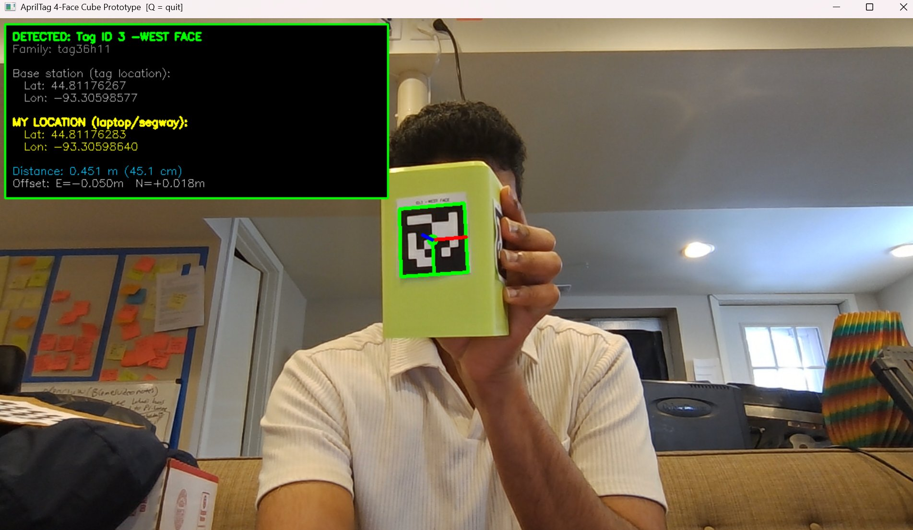

# AprilTag GPS Prototype

A proof-of-concept that computes a device's GPS coordinates using AprilTag fiducial markers instead of GPS. Place a tag at a known location, point a camera at it, and the system calculates the camera's lat/lon position in real time based on the tag's distance and angle.

Built as Phase 1 of the oTo segway localization system — solving GPS-denied positioning under bridges and covered structures.

## Demo



*Live detection of Tag ID 3 (WEST face) on a physical cube. The system computes the camera's GPS coordinates in real time from the tag's known position — no GPS needed.*

## How It Works

1. An AprilTag is placed at a **known GPS location** (manually entered)
2. A camera detects the tag and measures **distance + angle** to it
3. The system computes: `known tag position + measured offset = camera position`
4. Lat/lon updates live as the tag moves closer, farther, or side to side

## Demo Results

Tested with a laptop webcam and a tag printed on paper taped to a cube:

- **Position jitter:** ~7 cm (~3 inches) at 54 cm range
- **Phone GPS error (same session):** 50-60 meters off
- **AprilTag was ~700x more accurate than GPS**

## Setup

```bash
pip install opencv-python numpy pupil-apriltags moms-apriltag Pillow
```

## Usage

```bash
python april_2.py
```

The script will:
1. Generate 4 AprilTag images (N/E/S/W) in an `april_tags/` folder
2. Ask you to measure the printed/displayed tag size in cm
3. Open your webcam and detect any of the 4 tags
4. Show live GPS coordinates, distance, and detected face name on screen
5. Press **Q** to quit

## Configuration

Edit the coordinates at the top of `april_2.py` to set your base station location:

```python
BASE_LATITUDE  = 45.03244197593199    # Your location
BASE_LONGITUDE = -93.08111888039345   # Your location
```

## 4-Tag Cube Layout

```
         Tag ID 0
         (NORTH)
        ┌────────┐
Tag ID 3│        │Tag ID 1
(WEST)  │  Cube  │(EAST)
        └────────┘
         Tag ID 2
         (SOUTH)
```

Print all 4 tags, tape them on a box, and the camera will detect whichever face is visible.

## Tag Family

Uses **tag36h11** — a 6x6 grid with hamming distance 11. Most robust family with 587 unique IDs. Each tag in the family differs by at least 11 cells, making it nearly impossible to confuse one tag for another even with partial occlusion.

## Known Warning

```
Error, more than one new minima found.
```

This is harmless. When the camera views a flat tag nearly head-on, two 3D poses can produce the same 2D image. The library finds both solutions and picks the best one. It does not affect accuracy — our test showed stable ~7 cm jitter despite this warning on every frame.

## Repo Structure

```
├── README.md
├── demo_screenshot.png
├── april_2.py
└── april_tags/            ← generated when you run the script
    ├── tag36h11_id0_NORTH.png
    ├── tag36h11_id1_EAST.png
    ├── tag36h11_id2_SOUTH.png
    ├── tag36h11_id3_WEST.png
    └── ALL_4_TAGS_COMBINED.png
```

## Requirements

- Python 3.8+
- Webcam
- A printed or displayed AprilTag

## References

- [AprilTag 3](https://april.eecs.umich.edu/software/apriltag) — Olson, University of Michigan
- [pupil-apriltags](https://github.com/pupil-labs/apriltags) — Python bindings
- [Point-LIO](https://github.com/dfloreaa/point_lio_ros2) — Next phase: LiDAR-inertial odometry
